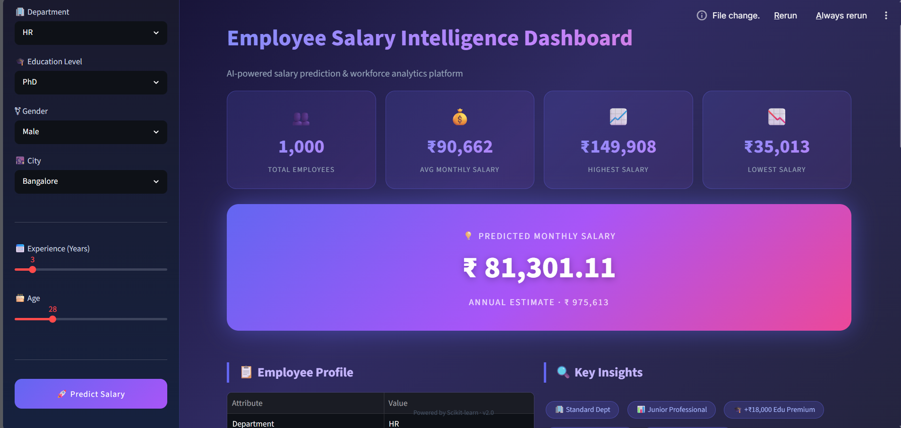
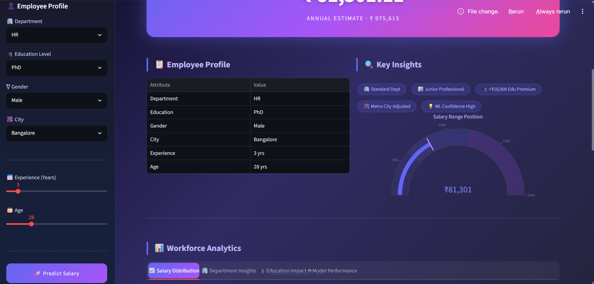

# 💼 Employee Salary Prediction using Machine Learning


---

## 📌 Project Overview

This project predicts an employee's monthly salary based on several professional attributes using Machine Learning.

The project includes:

- Data Analysis
- Data Preprocessing
- Feature Engineering
- Model Training
- Model Comparison
- Best Model Saving
- Prediction Pipeline
- Streamlit Web Application

---

## 📂 Dataset

Features used:

- Department
- Experience
- Education Level
- Age
- Gender
- City

Target:

- Monthly Salary

---

## 🧠 Machine Learning Models

- Linear Regression
- Decision Tree
- Random Forest
- Gradient Boosting

The best-performing model is automatically saved.

---

## 📊 Technologies Used

- Python
- Pandas
- NumPy
- Scikit-Learn
- Joblib
- Streamlit

---

## 🚀 Installation

Clone the repository

```bash
git clone https://github.com/YOUR_USERNAME/employee-salary-prediction.git
```

Move into the folder

```bash
cd employee-salary-prediction
```

Install dependencies

```bash
pip install -r requirements.txt
```

Run the app

```bash
streamlit run app.py
```

---

## 📸 Screenshots

### Home



### Prediction



---

## 📈 Workflow

```
Dataset
      │
      ▼
Data Analysis
      │
      ▼
Preprocessing
      │
      ▼
Feature Engineering
      │
      ▼
Model Training
      │
      ▼
Model Comparison
      │
      ▼
Best Model
      │
      ▼
Prediction Pipeline
      │
      ▼
Streamlit Web App
```

---

## 🎯 Future Improvements

- Hyperparameter Tuning
- XGBoost
- CatBoost
- LightGBM
- Docker Deployment
- Cloud Deployment
- REST API
- SHAP Explainability

---

## 👨‍💻 Author

**Abin Jose**

If you like this project, give it a ⭐.
